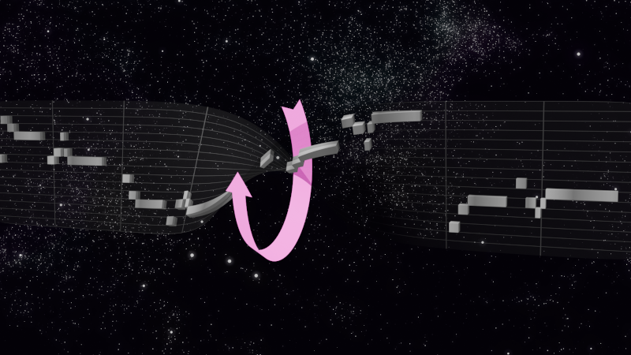

# Midi Twister 360

**Midi Twister 360** will flip the pitch of your midi files.

This tool might help if

- You want to know how a melody or chord progression sounds flipped
- [Your music doesn't sound serious enough.](https://web.archive.org/web/20210725090647/https://old.reddit.com/r/musicproduction/comments/oqzsa7/how_do_you_make_a_melody_more_serious_sounding/)
- You just want to listen to garbage

