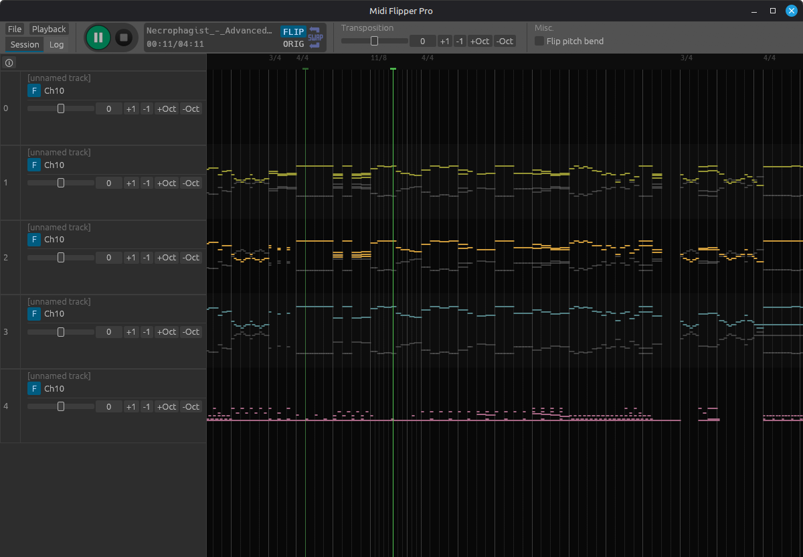

# Midi Twister 360

**Midi Twister 360** inverts the pitch of every note in your midi files.

Up becoms down and down becomes up. Major becomes minor and minor becomes major. Good music becomes bad and bad music becomes a different flavour of bad.

This tool might help if

- You want to experiment with [mirror scales](https://music.stackexchange.com/questions/51131/do-all-modes-make-another-mode-when-mirrored-i-e-intervals-reversed/51140)
- [Your music doesn't sound serious enough](https://web.archive.org/web/20210725090647/https://old.reddit.com/r/musicproduction/comments/oqzsa7/how_do_you_make_a_melody_more_serious_sounding/)
- Your music sounds too serious and you wish to make it sound like royalty free youtube music instead
- You have a happy ice cream truck jingle, but drive a van that delivers tax notices to depressed adults
- You just enjoy listening to garbage

## Examples

- Mario secret slide theme: https://youtu.be/-_yv-oOx62I
- Tax notice van: https://youtu.be/Xggx0ZwiXMI

## Download

Go to [releases](https://github.com/sevonj/midi-flipper/releases) and grab the latest one.

Builds exist for Linux and Windows

(x86_64)
